[DUCKERZ CTF 2026 ](https://teams.duckerz.ru/)

---

***Заброшенный маяк***
---

К задаче приложен файл `firmware.elf`. По описанию понятно, что зашифрованное послание находится прямо в прошивке.

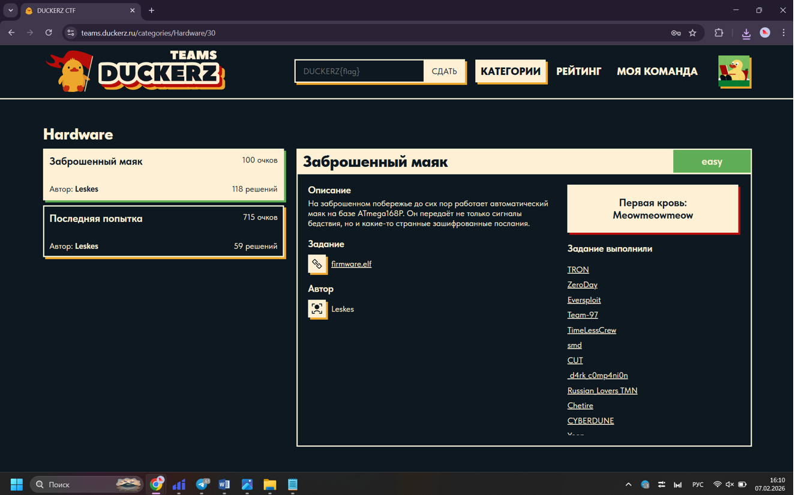

Сначала проверbv структуру `firmware.elf`, чтобы понять, где именно в ELF лежат полезные данные. Просмотр секций показал наличие области EEPROM, куда часто кладут строки, сообщения и области данных программы.

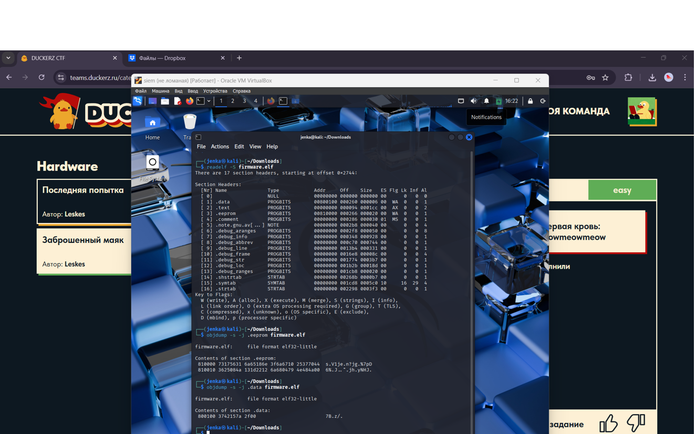

Затем извлечем содержимое EEPROM как зашифрованный текст и отдельно найдем в данных программы короткий массив байт, который использовался как ключ. После этого расшифруем сообщение посредством XOR с повторением ключа по кругу и получим флаг.

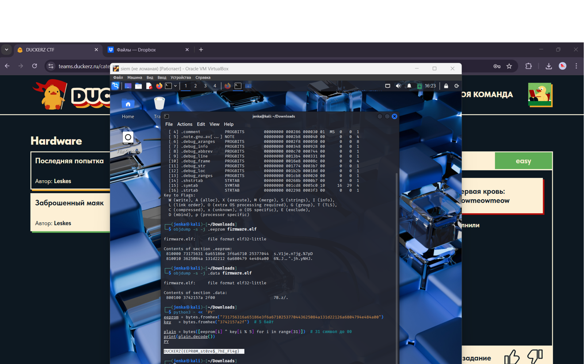

Проверим флаг на сайте.

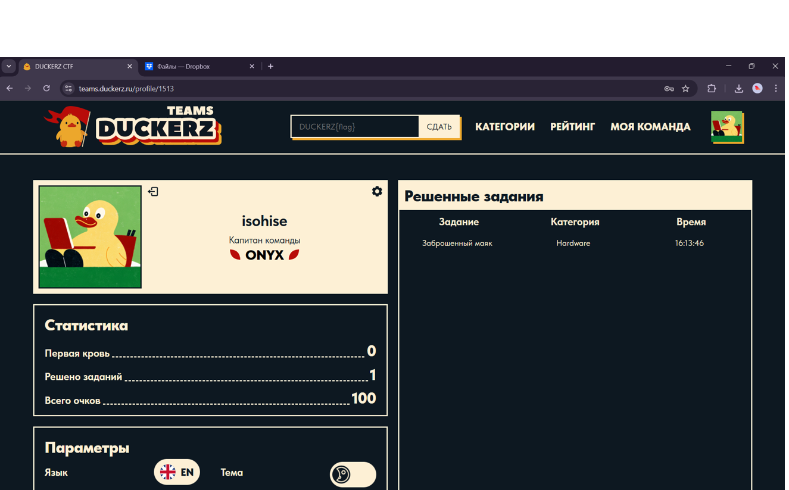

---

***Сокосокобанбан***
---

К задаче приложен архив с игрой, также возможен удаленный запуск по SSH. По описаничто понятно, удача на самом деле контролируется и её можно воспроизвести, если понять, как формируется случайность.

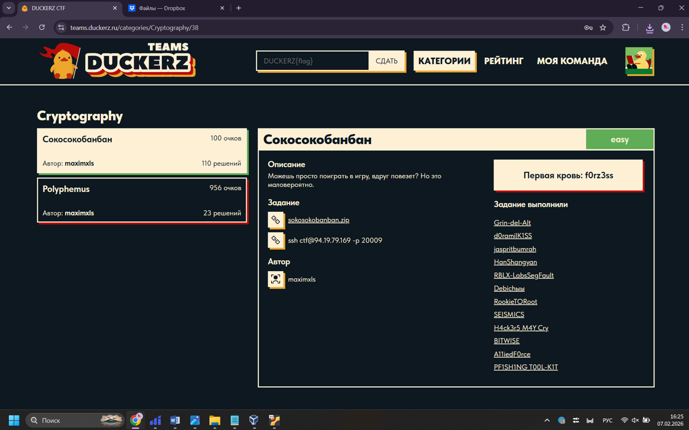

Чтобы не подбирать руками последовательность ходов, был написан скрипт, который вычисляет “правильный” стартовый 64-битный seed для генератора случайных чисел так, чтобы после одного шага генератора получилось значение 1, то есть игра гарантированно считает, что “повезло”. Затем он кодирует этот seed в первые 32 хода: разбивает его на пары бит и переводит их в символы WASD, выводя готовую последовательность для ввода в игре.

```python
MASK = (1 << 64) - 1

LCG_A = 6364136223846793005
LCG_B = 1442695040888963407

bits_to_key = {0: "w", 1: "a", 2: "s", 3: "d"}

def modinv_2k_odd(a: int, k: int) -> int:
    assert a & 1 == 1
    x = 1  # верно mod 2
    m = 1
    while m < k:
        m2 = min(2 * m, k)
        x = (x * (2 - (a * x) & ((1 << m2) - 1))) & ((1 << m2) - 1)
        m = m2
    return x

def main():
    invA = modinv_2k_odd(LCG_A, 64)

    seed = ((1 - LCG_B) * invA) & MASK

    moves = []
    for i in range(32):
        shift = 2 * (31 - i)
        bits = (seed >> shift) & 0x3
        moves.append(bits_to_key[bits])

    seq = "".join(moves)
    print(seq)

    nxt = (LCG_A * seed + LCG_B) & MASK
    assert nxt == 1, f"check failed: next={nxt}"

if __name__ == "__main__":
    main()
```

Запускаем скрипт и получаем последовательность первых 32 шагов, которые необходимо сделать, чтобы состояние генератора случайных чисел стало правильным и дальнейшая проверка в конце игры прошла как «повезло».

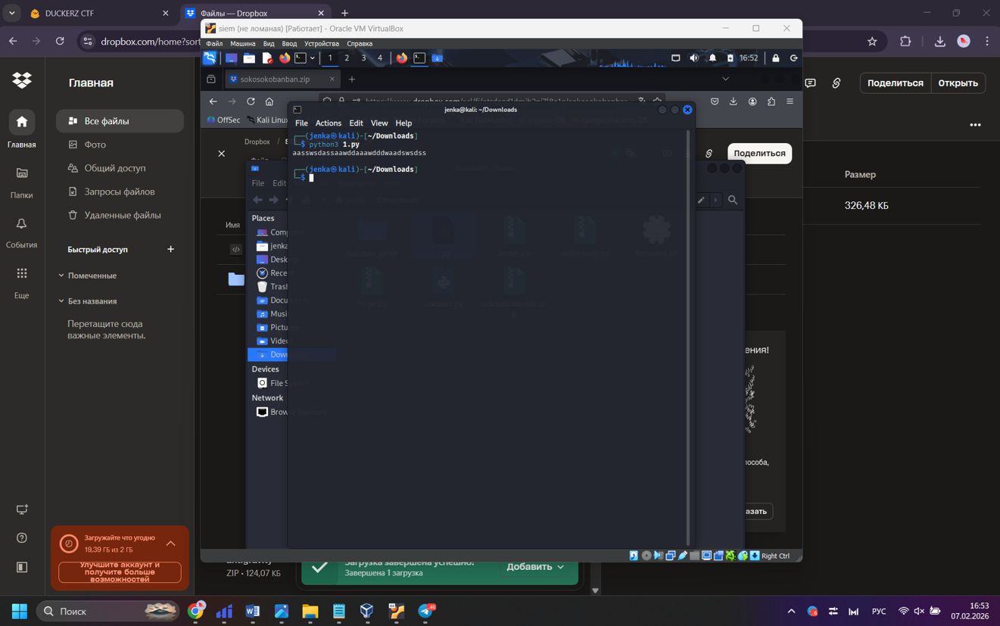

Далее пройдем уровни игры на сервере. Сначала введем рассчитанные первые 32 хода, после перезапустим уровень и продолжим прохождение игры.

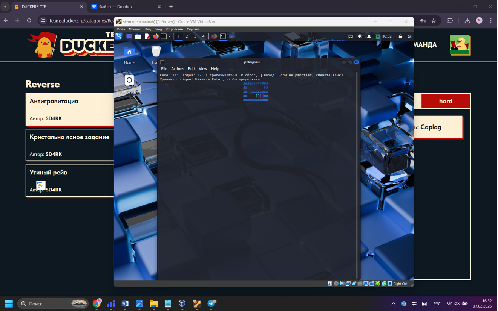

После завершения игры появилась финальная надпись «Вы выиграли флаг. Повезло!» и строка с флагом.

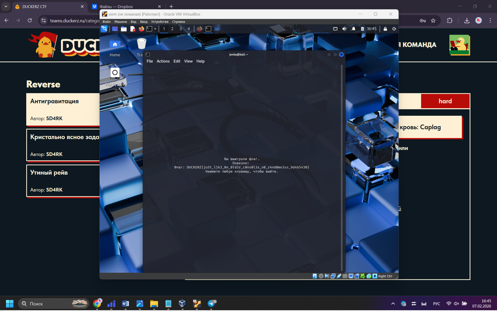

Проверим полученный флаг.

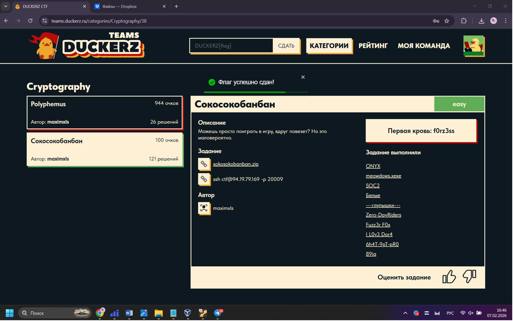

---

***Убежище 87***
---

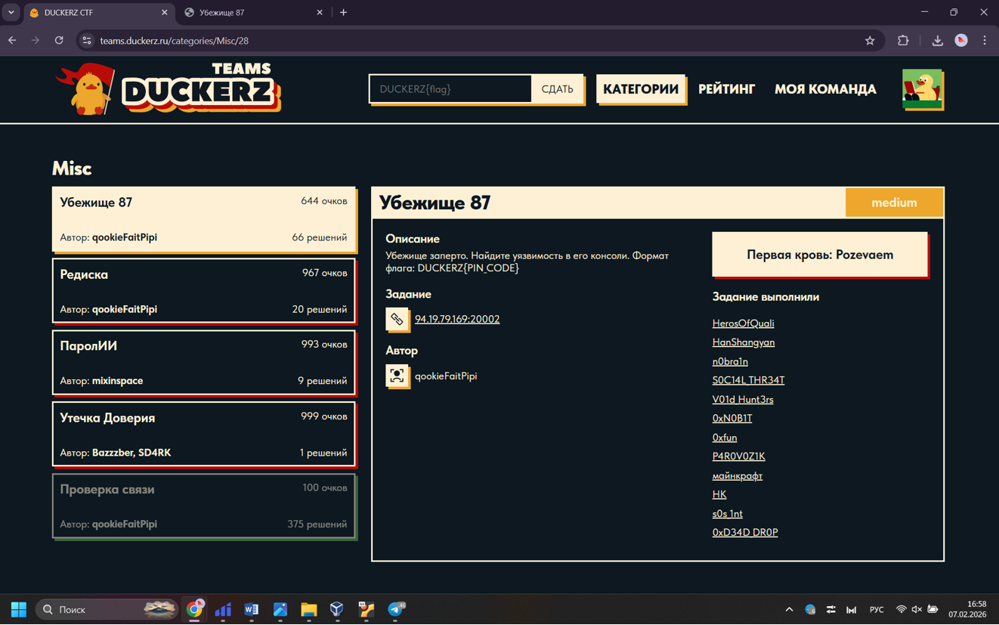

Начнем разбирать загружаемые скрипты и увидим, что страница использует WebAssembly (подключён `index.wasm`), поэтому будем искать места, где JavaScript связывает ввод, вывод с wasm и где могут быть проверки PIN.

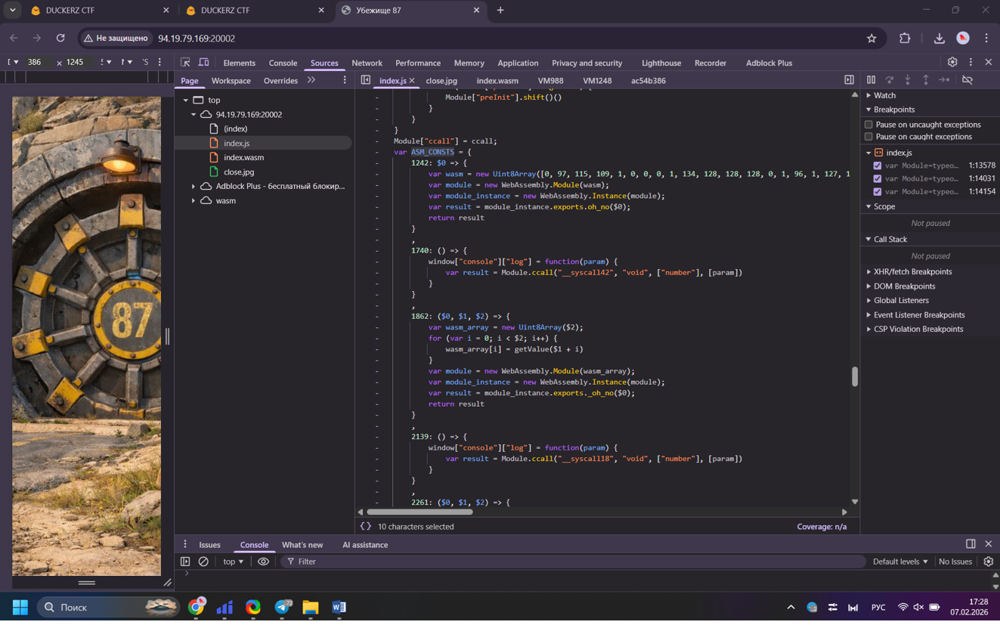

Затем откроем сам `index.wasm` в просмотрщике байткода и найдем участок с константами и сравнениями, который выглядит как логика проверки, именно тут код принимает число и сравнивает его с эталоном, а значит можно вытащить правильные параметры проверки из клиентской части.
Это цепочка этапов, где каждый этап проверяет одну цифру и перепривязывает console.log на следующий syscall:
- ASM_CONSTS[5083] → console.log = ввод в __syscall80 → ждёт 1
- ASM_CONSTS[5261] → console.log = __syscall72 → ждёт 3
- ASM_CONSTS[1740] → console.log = __syscall42 → ждёт 3
- ASM_CONSTS[2139] → console.log = __syscall18 → ждёт 7
- ASM_CONSTS[2537] → console.log = the_end → ждёт 1
- ASM_CONSTS[3794] → console.log = __syscall12 → ждёт 2
- ASM_CONSTS[4382] → console.log = __syscall188 → ждёт 3 → вызывает ASM_CONSTS[4505] (открытие)

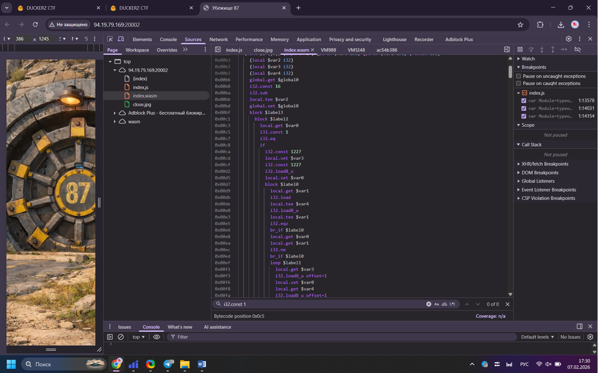

После этого используем консоль браузера как канал наблюдения. По журналу видим повторяющийся набор чисел 3, 3, 7, 1, 2, 3, который соответствует искомому PIN-коду.

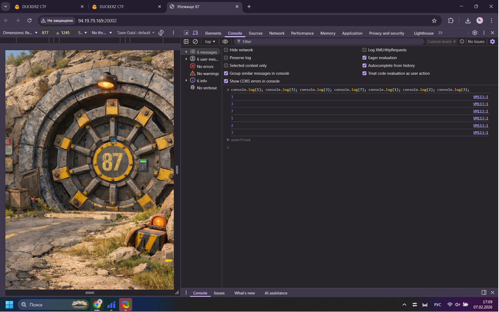

Проверим полученный флаг.
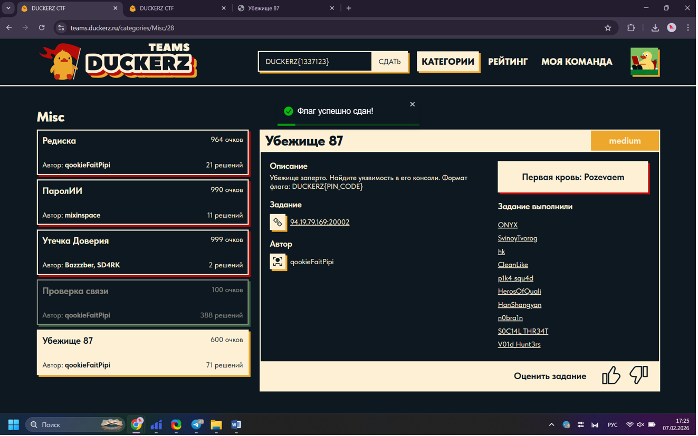
