[TaipanByte CTF](https://chart.taipanbyte.ru/)

---

***T-8000***
---

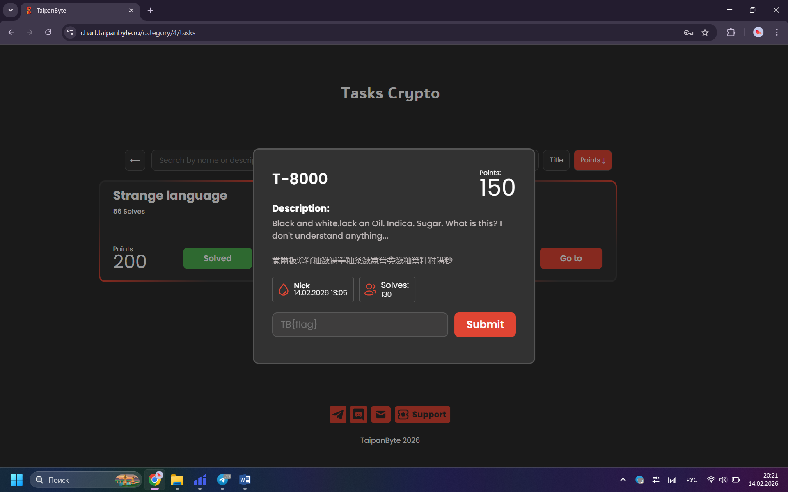

Флаг получился угадыванием по подсказке.

Black and white / Indica / Sugar / lack an oil → всё ведёт к рису (rice) и намёку “очень просто”.

Взяла типичную CTF-фразу “its easy for solve” и записала ее leet:

its → 1ts

easy → 3@sy

for → f0r

solve → s0lv3

Обернула в формат: `TB{1ts_3@sy_f0r_s0lv3}`.

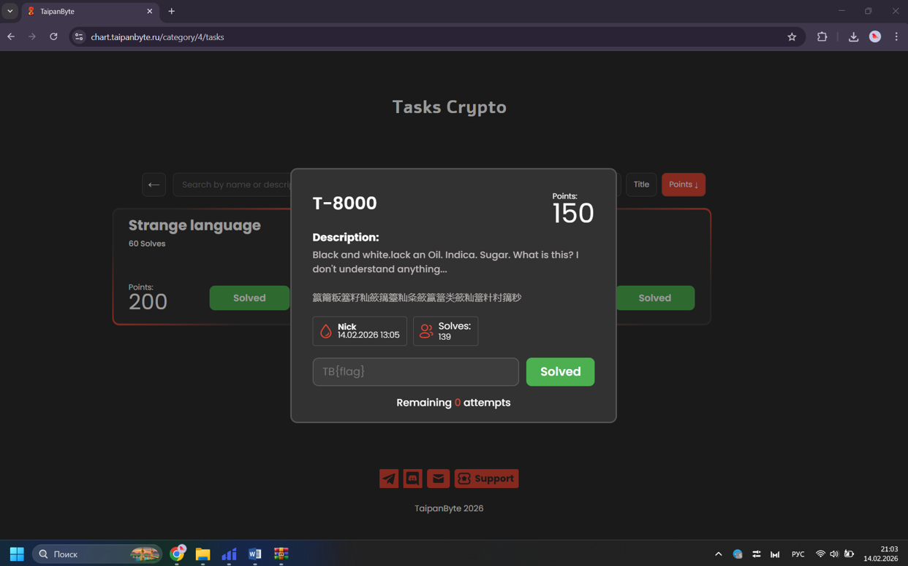

---

***Hdden***
---

К задаче приложен файл hide.tb.

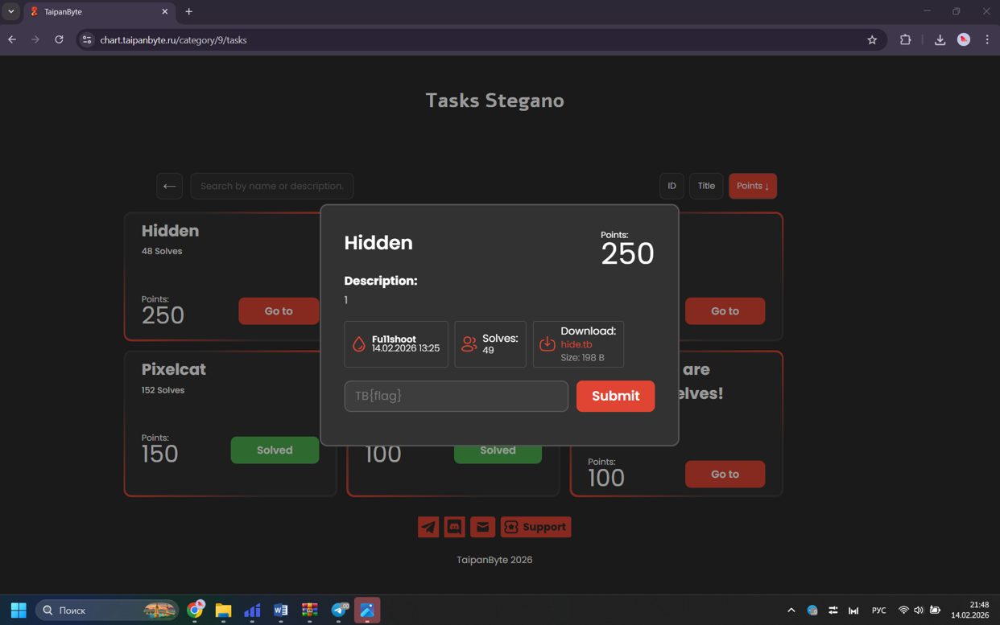

Сначала откроем файл в шестнадцатеричном виде. В дампе видно множество повторяющихся последовательностей байт вида `e2 80 80, e2 80 82, e2 80 83, c2 a0` и других похожих кодов. Это различные Unicode-пробелы. Всего обнаруживается 8 различных типов пробельных символов.

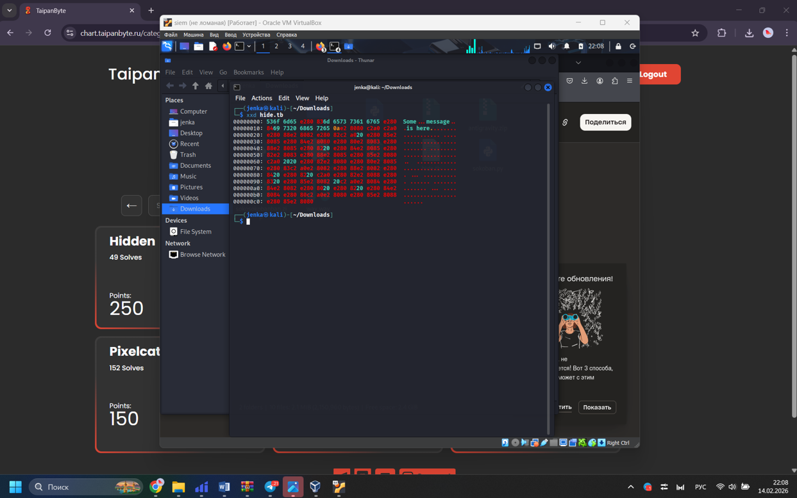

Далее напишем скрипт, который считывает файл, отбрасывает первую строку, собирает список уникальных пробельных символов, сопоставляет каждому символу цифру 0–7, преобразует последовательность пробелов в строку восьмеричных цифр, каждые 3 цифры переводит в один ASCII-символ.

```python
from pathlib import Path

data = Path("hide.tb").read_bytes().decode("utf-8", errors="strict")

pos = data.find("\n")
if pos == -1:
    raise SystemExit("Нет переноса строки — нечего декодировать")
hidden = data[pos+1:].replace("\n", "").replace("\r", "")

uniq = []
for ch in hidden:
    if ch not in uniq:
        uniq.append(ch)

if len(uniq) != 8:
    print(f"[!] Предупреждение: уникальных символов = {len(uniq)} (ожидалось 8)")

mapping = {ch: str(i) for i, ch in enumerate(uniq)}

digits = "".join(mapping[ch] for ch in hidden)

out = bytearray()
for i in range(0, len(digits), 3):
    chunk = digits[i:i+3]
    if len(chunk) < 3:
        break
    out.append(int(chunk, 8))

print(out.decode("utf-8", errors="replace"))
```

Запустим скрипт и получим флаг `TB{dmd_1s_h@rd_t0_C0mp1l3}`.

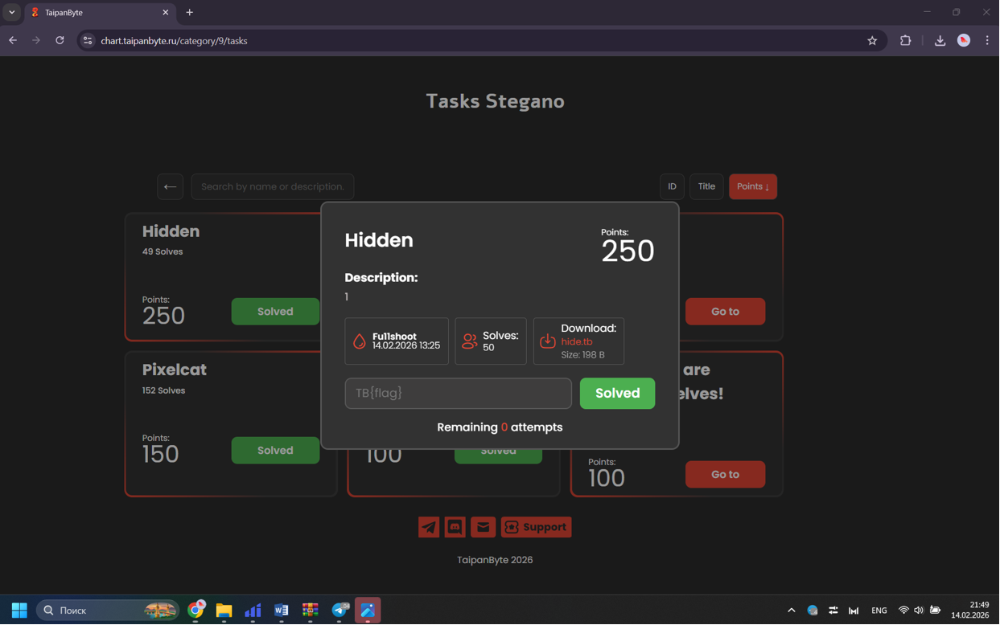

---

***Indian WAV***
---

К задаче приложен файл wav.wav.

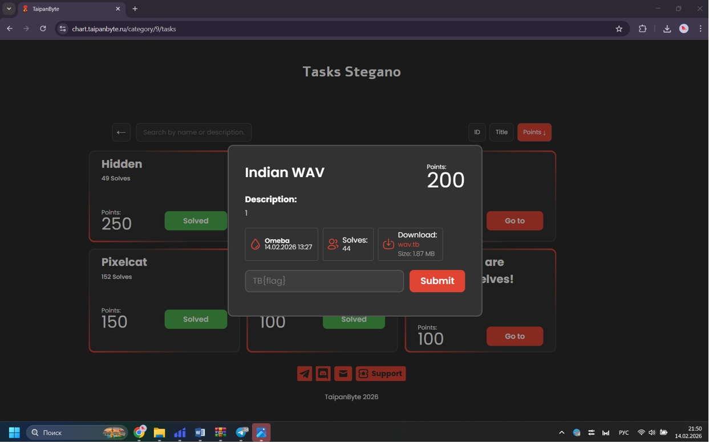

Было принято решение проверить два самых типичных варианта LSB-стеганографии: LSB каждого байта аудиопотока, LSB младшего байта каждого 16-битного семпла.

Для автоматизации извлечения был написан скрипт. Он открывает WAV-файл через модуль wave, считывает все аудиофреймы, извлекает младшие биты, собирает их в байты, пробует декодировать результат как текст, ищет в полученной строке подстроку формата TB{...}.

```python
import wave  
FN = "wav.wav" 

def bits_to_bytes(bits): 
    out = bytearray() 
    for i in range(0, len(bits) - 7, 8): 
        b = 0 
        for j in range(8): 
            b = (b << 1) | bits[i + j] 
        out.append(b) 
    return bytes(out) 

def try_extract(frame_bytes, label): 
    bits = [x & 1 for x in frame_bytes] 
    data = bits_to_bytes(bits) 
    text = data.decode("latin1", errors="ignore") 
    start = text.find("TB{") 
    if start != -1: 
        end = text.find("}", start) 
        if end != -1: 
            print(f"[+] {label}: {text[start:end+1]}") 
            return True 
    return False 

with wave.open(FN, "rb") as w: 
    frames = w.readframes(w.getnframes()) 

if try_extract(frames, "LSB of every byte"): 
    raise SystemExit 

if try_extract(frames[0::2], "LSB of low byte of each 16-bit sample"): 
    raise SystemExit 

print("[-] Flag not found with these two common LSB modes.") 
```

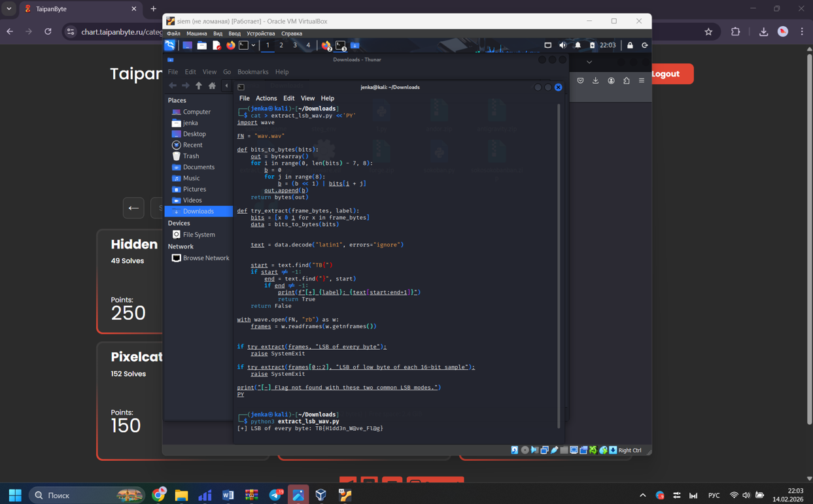

После запуска скрипта был получен флаг, провряем его.

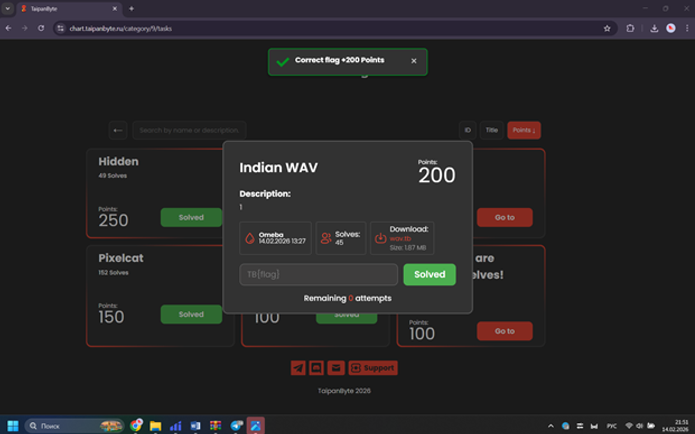

---

***Island***
---

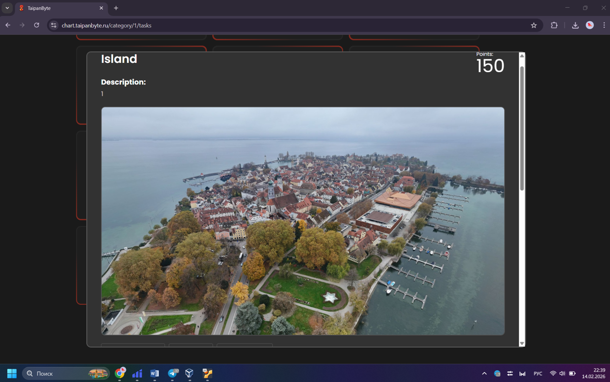

Делаем поиск по фото и находим данный остров, видим его название.

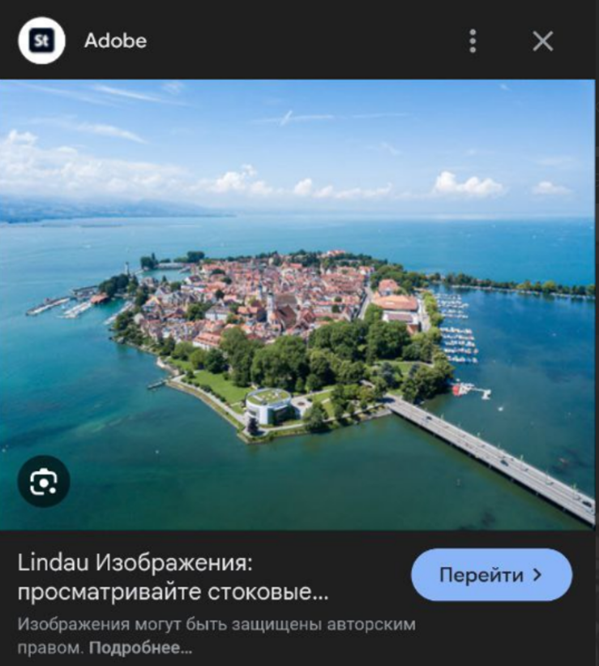

По названию ищем остров на картах и находим таким обраом координаты.

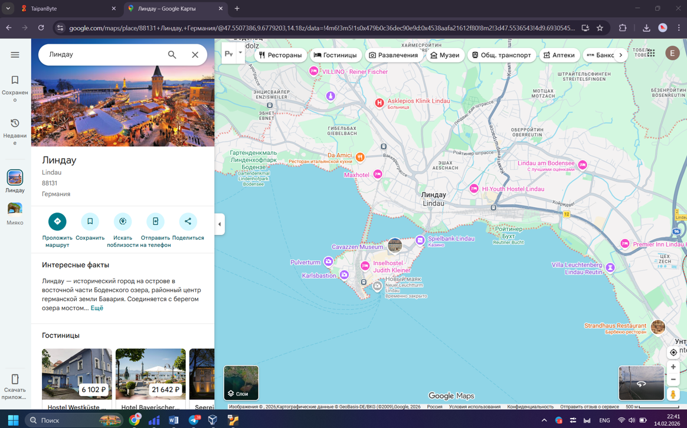

Проверяем найденные координаты на сайте.

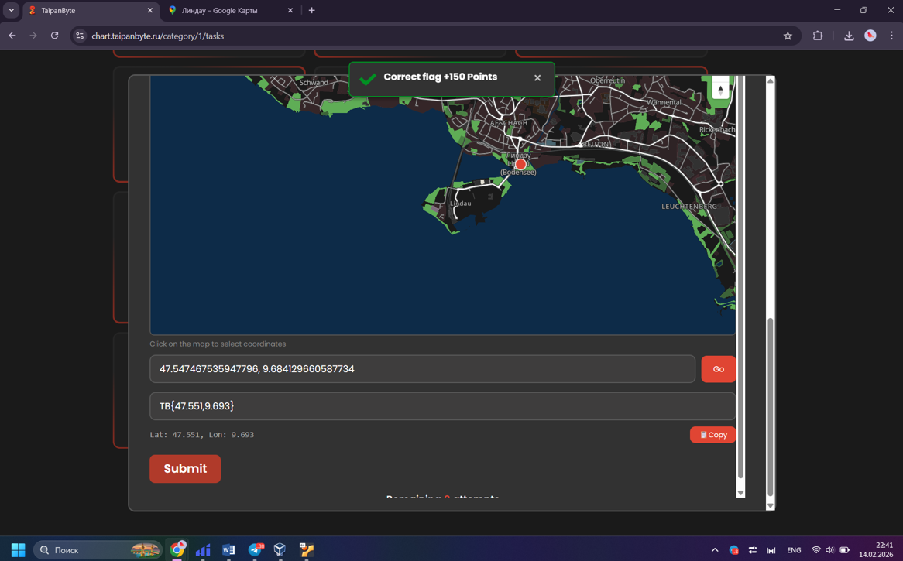

---

***Viewing Point***
---

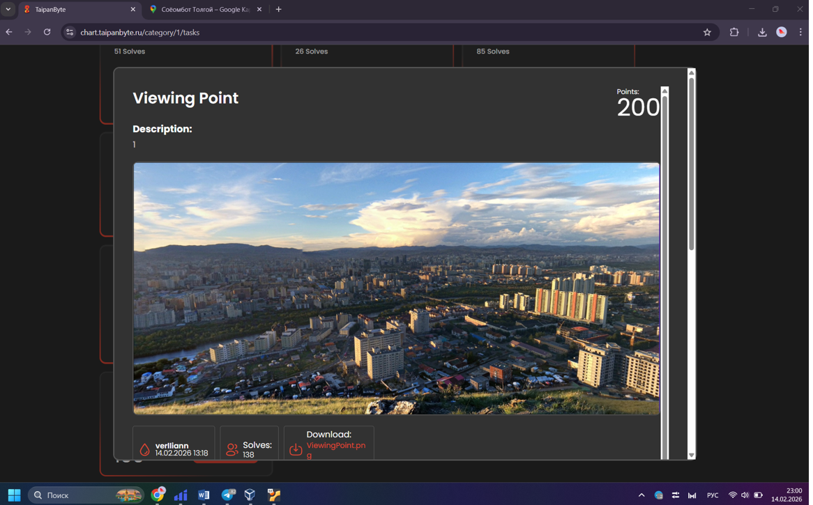

Также делаем посик по фото и находим город, в котором сделано фото.


В этом городе находим смотровую площадку, с которой сделано фото.

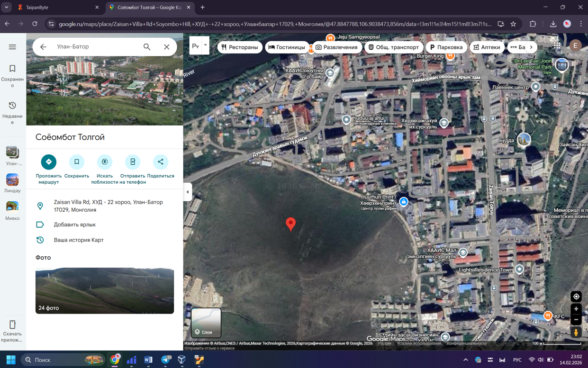

Вводим координаты сотровой площадки на сайт.

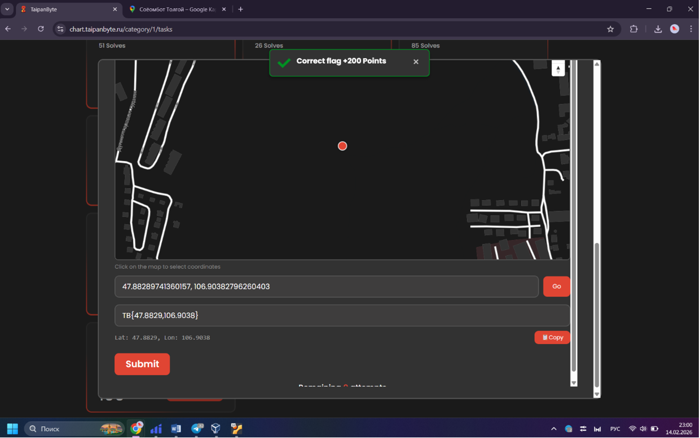

---

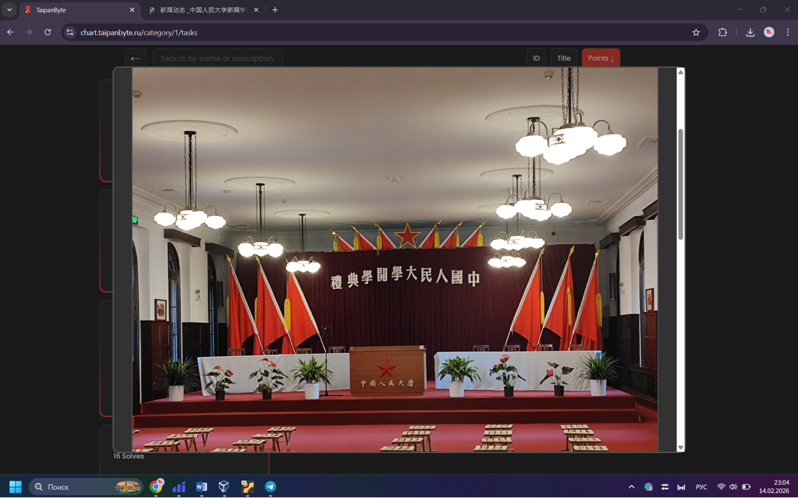

Делаем поиск по фото, находим статью с фото с той же локацией.


Открываем статью, в ней помимо прочего есть фото здания снаружи и адрес улица Чжан Цзычжун, № 3, в Пекине.

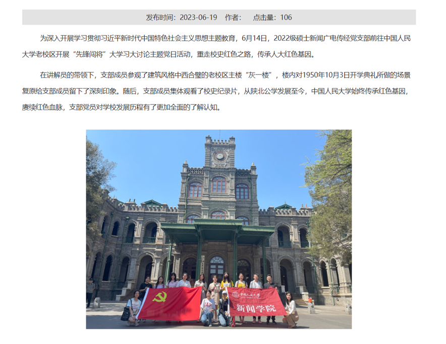

Находим это здание на картах.

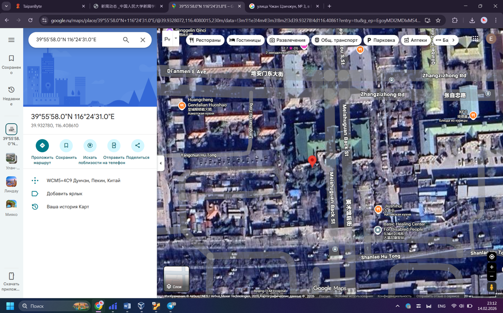

Вводим координаты найденного здания на сайте CTF.

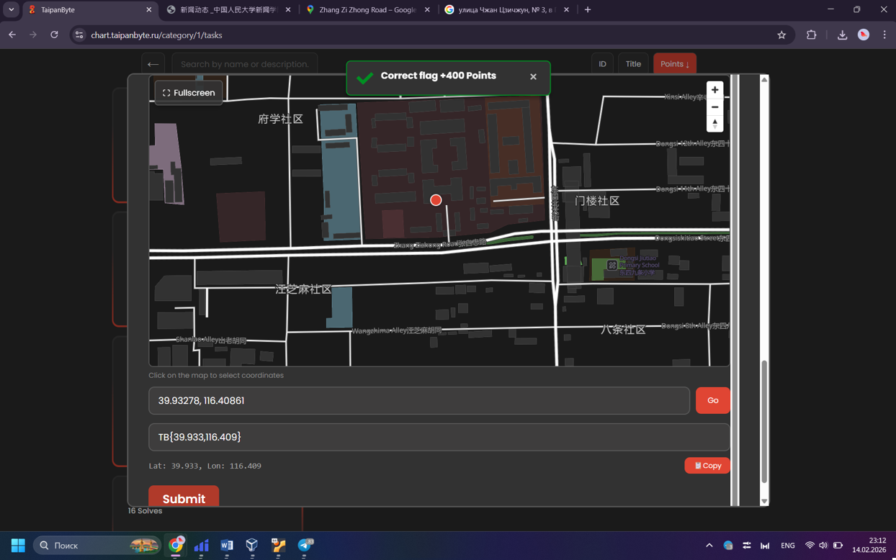
