[Герои Кодекса](https://caplag.ru/competitions/Geroi-Kodeksa/)

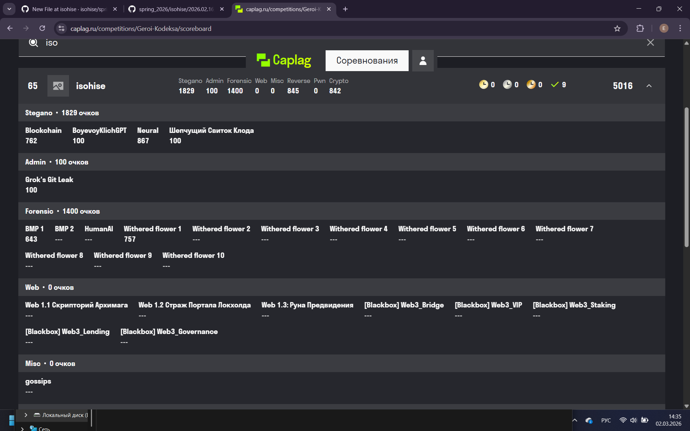

---

***Грааль***
---

В задаче дан файл `task.txt` с параметрами RSA.

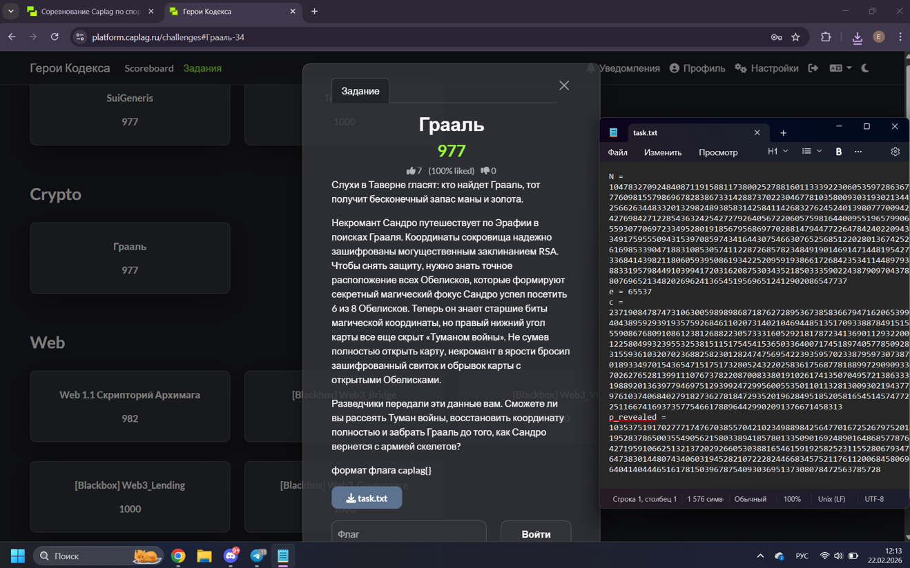

Напишем скрипт, который работает с многочленом по модулю, ищет малое значение добавки и выводит найденный корень, который восстанавливает полный простой множитель.

```python
N = 10478327092484087119158811738002527881601133392230605359728636777609815579869678283867331428873702230467781035800930319302134425662634483320132982489385831425841142683276245240139807770094242769842712285436324254272792640567220605759816440095519657990655930770697233495280191856795686977028814794477226478424022094334917595550943153970859743416443075466307652568512202801367425261698533904718831085305741122872685782348491901469147144819542733684143982118060593950861934225209591938661726842353411448979388331957984491039941720316208753034352185033359022438790970437880769652134820269624136545195696512412902086547737

e = 65537

c = 2371908478747310630059898986871876272895367385836679471620653994043895929391935759268461102073140210469448513517093388784915155590867680910861238126882230573331605292181787234136901129322001225804993239553253815115175454153650336400717451897405778509283155936103207023688258230128247475695422393595702338795973073870189334970154365471517517328052432202583617568778188997290909337026276528139911107673782208700833801910261741350704957213863331988920136397794697512939924729956005535011011328130093021943779761037406840279182736278184729352019628495185205816545145747722511667416937357754661788964429902091376671458313

p_revealed = 103537519170277717476703855704210234988984256477016725267975201195283786500355490562158033894185780133509016924890164868577876427195910662513213720292660530388165461591925825231155280679347647383014480743406031945282107222824466834575211761120068458069640414044465161781503967875409303695137308078472563785728

R.<x> = PolynomialRing(Zmod(N))
f = p_revealed + x

roots = f.small_roots(X=2^450, beta=0.4)

print(roots)
```

Данные перенесены в Sage для применения атаки на малый корень. В результате поиска найдено малое значение добавки, позволяющее восстановить полный простой множитель.

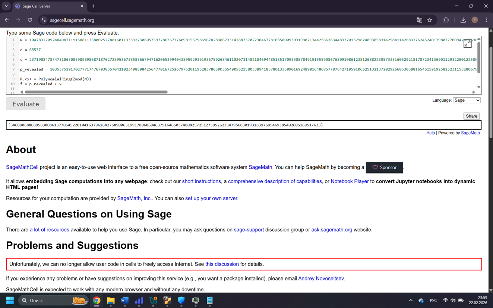

Далее составим второй скрипт для полного расшифрования. Он прибавляет найденную добавку к известной части, проверяет делимость модуля, вычисляет второй множитель, функцию Эйлера, закрытую экспоненту и выполняет расшифрование.

```python
N = 10478327092484087119158811738002527881601133392230605359728636777609815579869678283867331428873702230467781035800930319302134425662634483320132982489385831425841142683276245240139807770094242769842712285436324254272792640567220605759816440095519657990655930770697233495280191856795686977028814794477226478424022094334917595550943153970859743416443075466307652568512202801367425261698533904718831085305741122872685782348491901469147144819542733684143982118060593950861934225209591938661726842353411448979388331957984491039941720316208753034352185033359022438790970437880769652134820269624136545195696512412902086547737

e = 65537

c = 2371908478747310630059898986871876272895367385836679471620653994043895929391935759268461102073140210469448513517093388784915155590867680910861238126882230573331605292181787234136901129322001225804993239553253815115175454153650336400717451897405778509283155936103207023688258230128247475695422393595702338795973073870189334970154365471517517328052432202583617568778188997290909337026276528139911107673782208700833801910261741350704957213863331988920136397794697512939924729956005535011011328130093021943779761037406840279182736278184729352019628495185205816545145747722511667416937357754661788964429902091376671458313

p_revealed = 103537519170277717476703855704210234988984256477016725267975201195283786500355490562158033894185780133509016924890164868577876427195910662513213720292660530388165461591925825231155280679347647383014480743406031945282107222824466834575211761120068458069640414044465161781503967875409303695137308078472563785728

x = 346090688689583808613770645220104163796164275890063199178068694637516465037480825725127595262334795683019318397695469385402605169517633

p = p_revealed + x

if N % p != 0:
    print("Ошибка! p не делит N")
    exit()


q = N // p

phi = (p - 1) * (q - 1)

d = pow(e, -1, phi)

m = pow(c, d, N)

hex_m = hex(m)[2:]
if len(hex_m) % 2:
    hex_m = "0" + hex_m

flag = bytes.fromhex(hex_m)

print("\nФЛАГ:")
print(flag.decode())
```

Запустим скрипт, в результате получим расшифрованный текст.

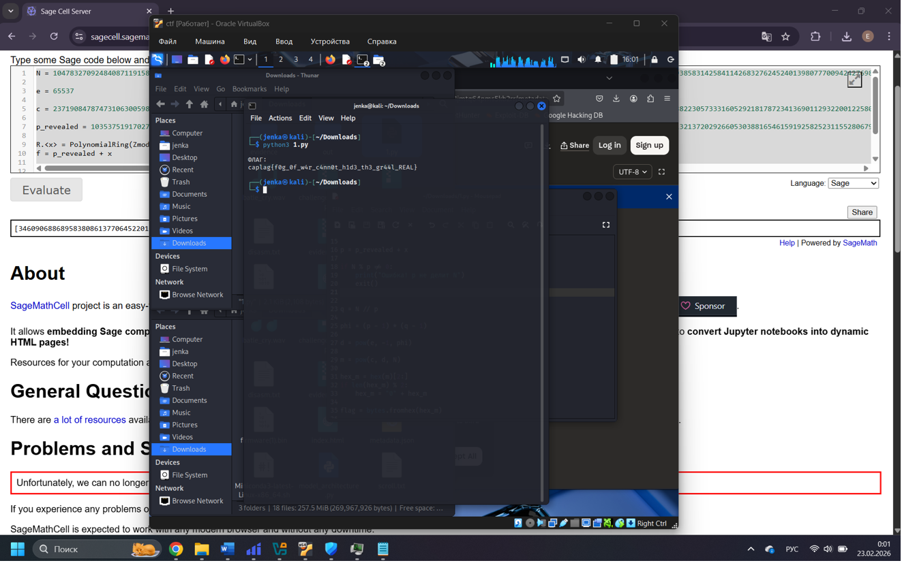

Введем полученный флаг на сайте.


---

***Шепчущий Свиток Клода***
---

В задаче дан файл `scroll.txt`, внутри которого находится текст с намёком на скрытое сообщение через unicode-эфир.

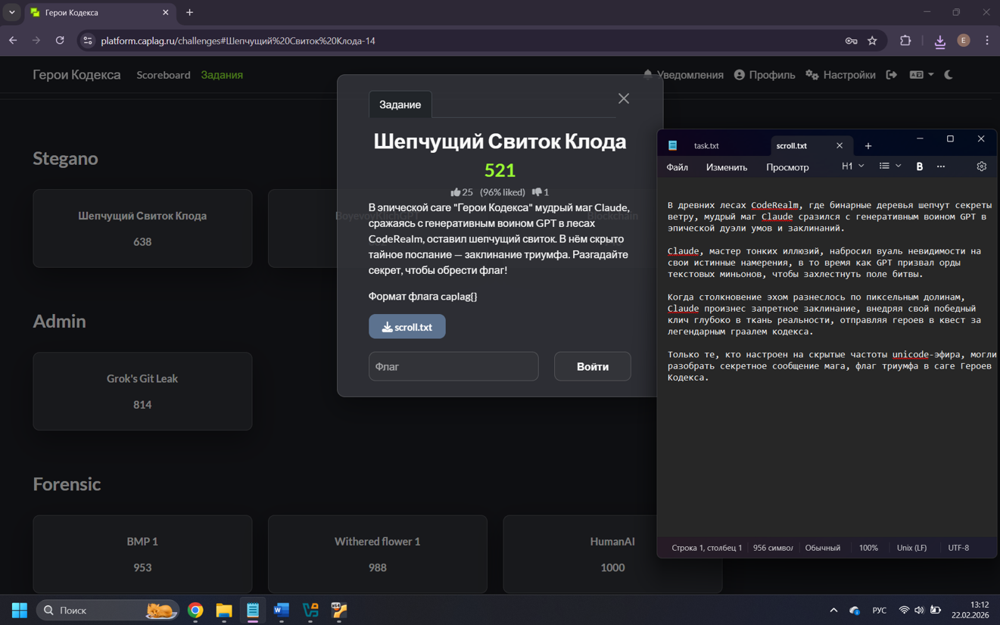

Открыв файл, видно обычный текст, однако при просмотре в шестнадцатеричном виде заметны повторяющиеся байты d0 и d1, что указывает на кириллицу в UTF-8. Это намекает на возможное сокрытие данных в бинарном представлении символов.

Напишем скрипт, который переводит каждый символ в бинарный вид, извлекает младшие биты каждого байта и собирает из них новое сообщение.

```python
import pathlib

s = pathlib.Path("scroll.txt").read_text("utf-8")
bits = "".join(format(ord(i),"08b") for i in s)
b = bytes(int(bits[i:i+8],2) for i in range(0,len(bits),8))
print(b.decode("utf-8","replace"))
```

Скрипт читает текст, переводит символы в двоичный формат, собирает поток бит и преобразует его обратно в байты, извлекая скрытое сообщение. После запуска получаем строку с флагом.

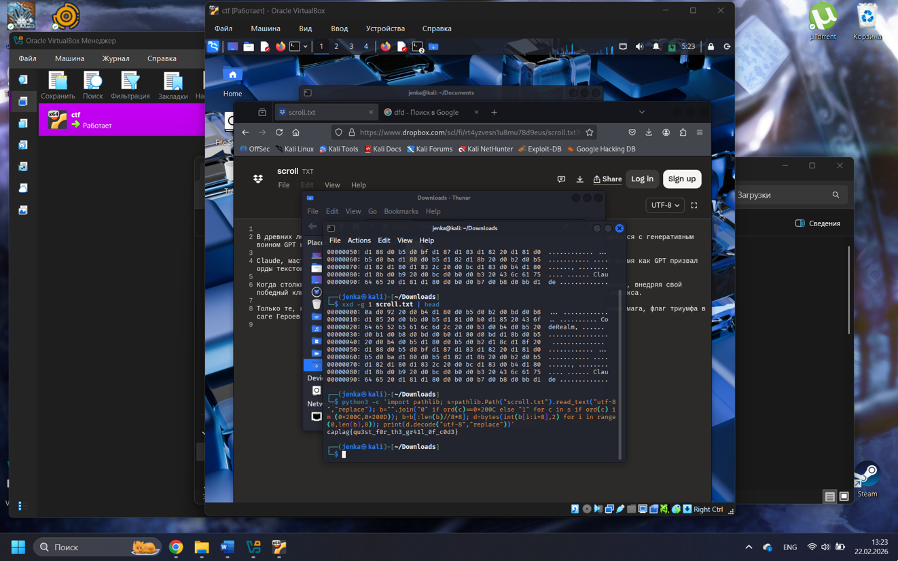

Вводим полученный флаг на сайте.

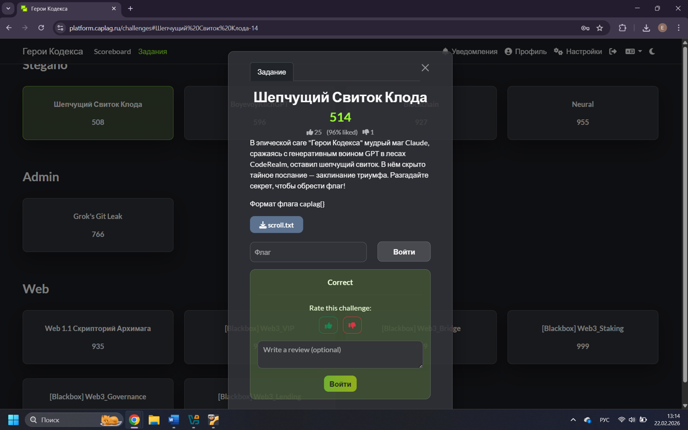

---

***Grok's Git Leak***
---

В задаче дан архив site.7z. По описанию намекается, что Grok забыл удалить служебные файлы со своего сервера.


Распакуем архив и посмотрим структуру. Внутри обнаруживается каталог `.git`, что указывает на утечку репозитория. Это позволяет просмотреть историю коммитов и восстановить удалённые файлы. Через просмотр истории видно коммит с добавлением секретного файла. Используем команду просмотра содержимого файла из конкретного коммита. При прямом выводе текст отображается некорректно, что намекает на неправильную кодировку. Декодируем содержимое в UTF-8 и получаем читаемый текст с флагом.

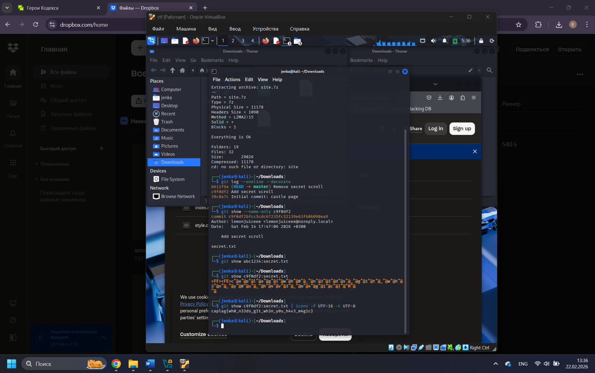

Вводим полученный флаг на сайте.


---

***Withered flower 1***
---

В задаче дан архив `evidence.zip`, пароль указан в описании. Требуется определить производителя, модель и ID сборки прошивки устройства.

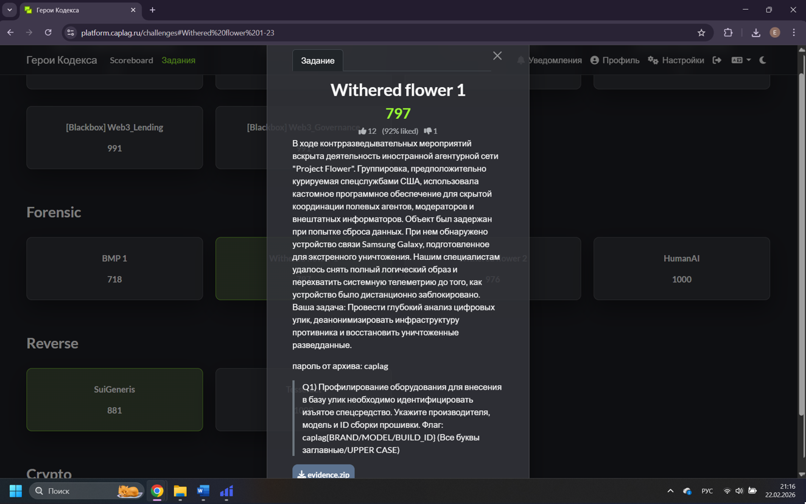

Распакуем архив и изучим структуру каталогов. Внутри находятся системные логи Android-устройства. В каталоге с информацией об устройстве обнаружен файл с техническими параметрами. Открыв файл с данными устройства, находим производителя samsung, модель SM-A346E и строку с fingerprint, содержащую ID сборки. Из неё извлекаем нужные значения и приводим их к формату UPPER CASE в соответствии с требованием задания.

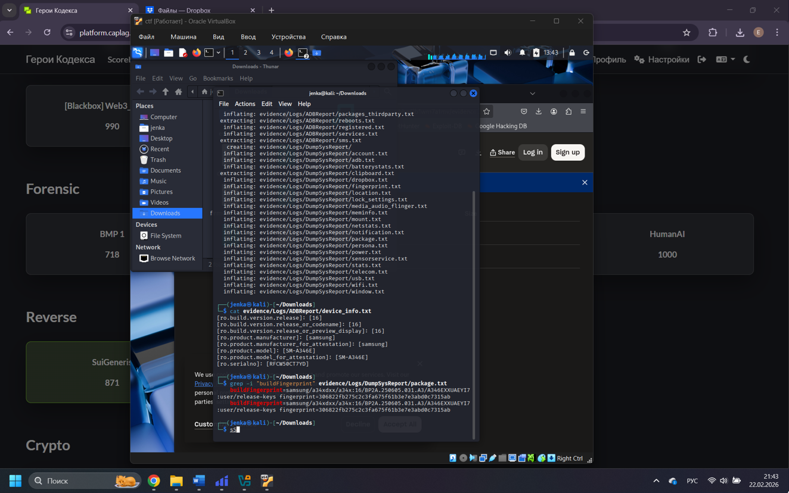

Вводим полученный флаг на сайте.

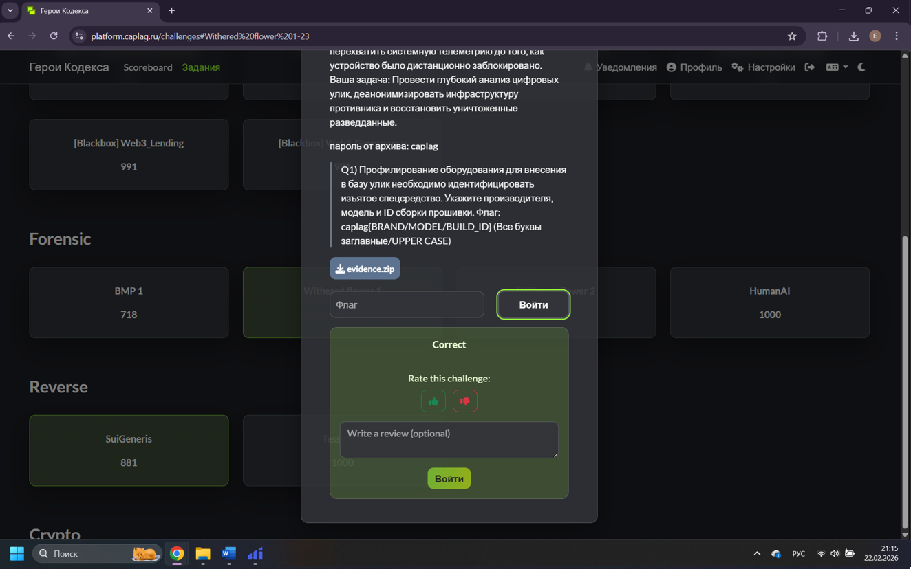

---

***BoyevoyKlichGPT***
---

В задаче дан аудиофайл `batle_cry.wav`. По описанию требуется прослушать запись и раскрыть скрытое заклинание.

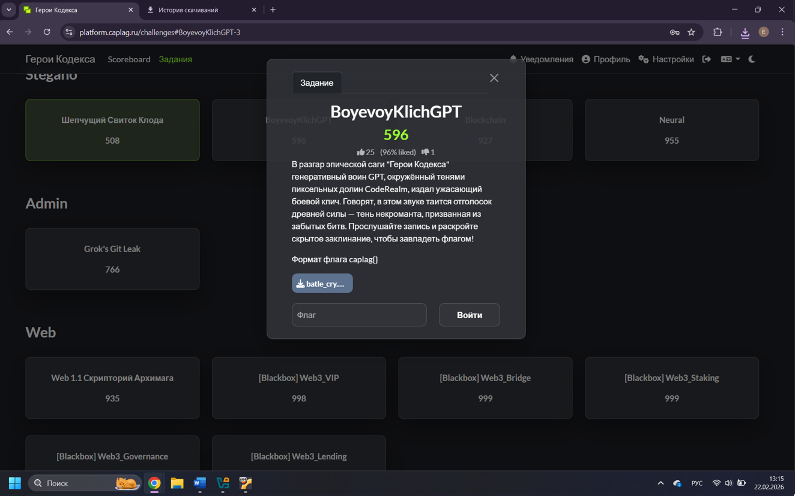

Напишем скрипт для построения спектрограммы с хорошим разрешением по частоте и выделим диапазон 13–15 кГц, где чаще всего прячут ультразвуковые надписи.

```python
import numpy as np
import matplotlib.pyplot as plt
from scipy.io import wavfile
from scipy.signal import spectrogram

wav_path = "batle_cry.wav"

sr, x = wavfile.read(wav_path)

if x.ndim > 1:
    x = x[:, 0]

f, t, S = spectrogram(x, sr, nperseg=4096, noverlap=2048)

mask = (f >= 13000) & (f <= 15000)
Sdb = 10 * np.log10(S[mask] + 1e-12)

plt.figure(figsize=(14, 4))
plt.pcolormesh(t, f[mask], Sdb, shading="auto")
plt.gca().invert_yaxis()
plt.axis("off") 
plt.tight_layout(pad=0)
plt.savefig("zoom_13_15khz.png", dpi=300, bbox_inches="tight", pad_inches=0)
print("saved: zoom_13_15khz.png")
```

После запуска получаем сохранённое изображение спектра.

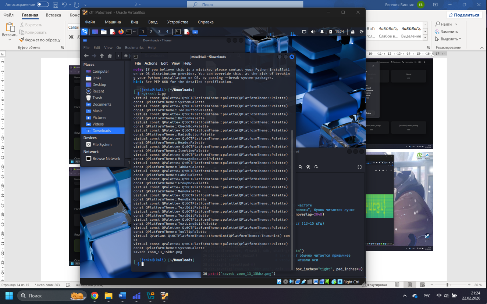

На спектрограмме отчётливо виден текст, спрятанный в ультразвуковом диапазоне.

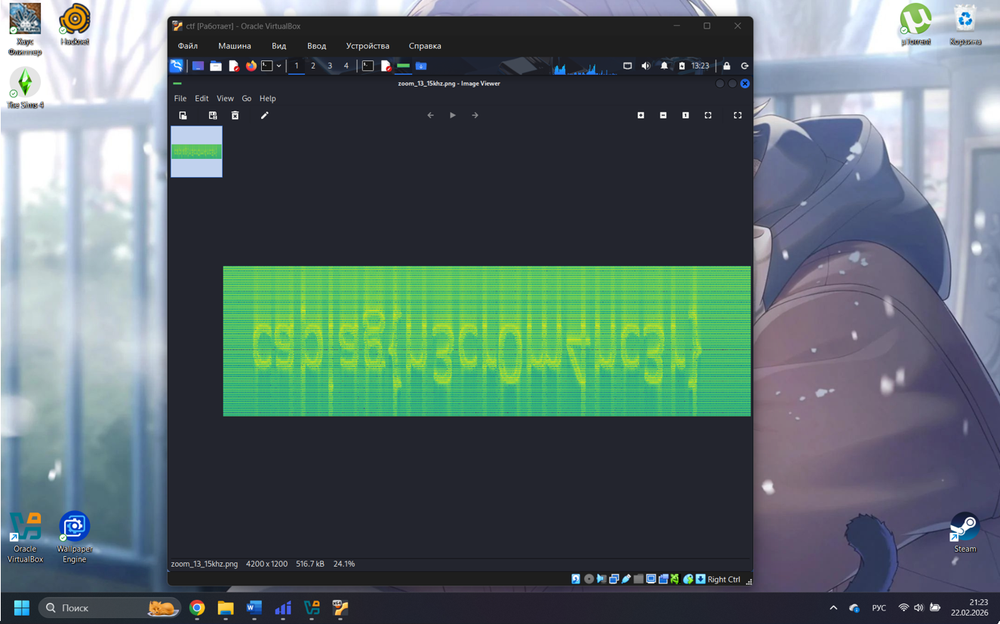

Вводим полученный флаг на сайте.


---

***Blockchain***
---

В задаче дан архив `task.zip`, внутри которого находится 13 подозрительных изображений.


Распакуем архив и проанализируем изображения. При просмотре файлов обнаруживаются фрагменты ASCII-строк, распределённые по разным PNG. Каждое изображение содержит часть общего сообщения. Соберём найденные фрагменты в правильном порядке. Из изображений извлекаются части: `blockch41n`, `st3g0`, `r33d_sol0m0n`, `m4st3r`, `2025`, а также префикс `caplag`. После объединения получается полный флаг.

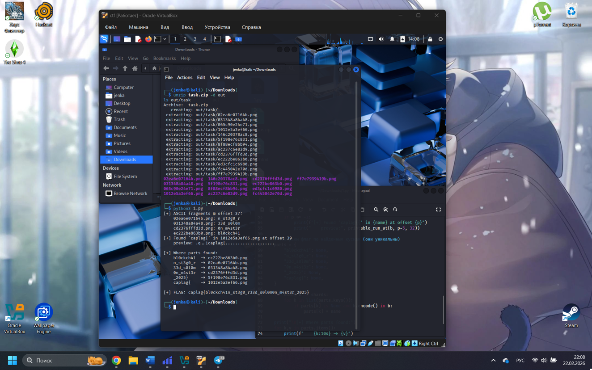

Вводим полученную строку на сайте.


---

***Neural***
---

В задаче даны файлы модели: веса нейросети и метаданные. По описанию флаг спрятан внутри весов обученной CNN.

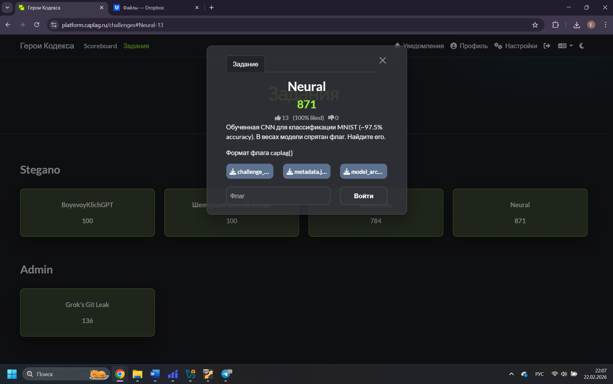

Напишем скрипт, который загружает файл с весами, объединяет все массивы в единый поток байтов и перебирает различные варианты порядка бит и смещения, пока не будет найден фрагмент `caplag{...}`. Скрипт загружает данные модели, преобразует значения в последовательность бит, затем собирает из них байты и проверяет наличие строки флага при разных вариантах интерпретации. После запуска скрипт находит корректную комбинацию порядка бит и смещения, в результате чего извлекается строка с флагом.

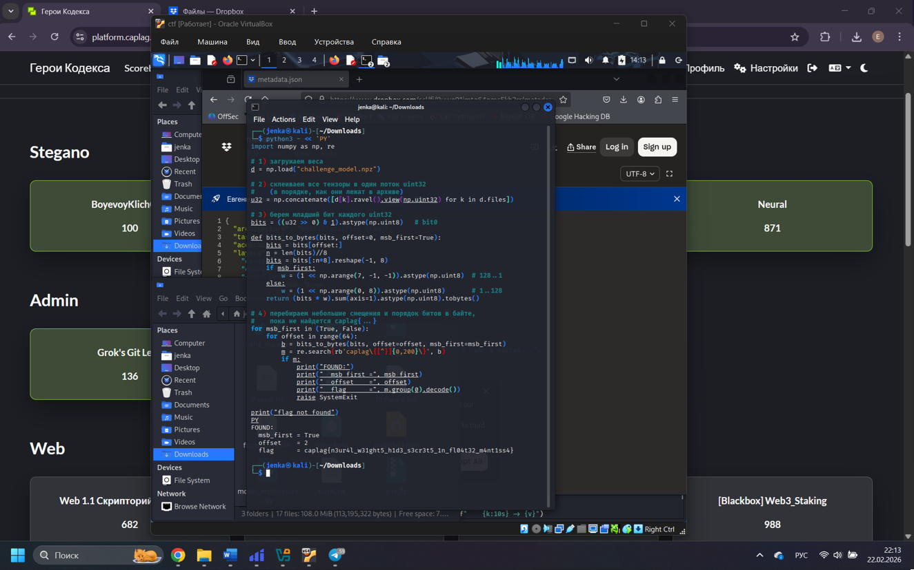

Вводим полученный флаг на сайте.


---

***SuiGeneris***
---


