[Learning Bear 2026](https://lb.sprush.rocks/)

---

***sjs***
---

К задаче приложен файл `lol.html`.

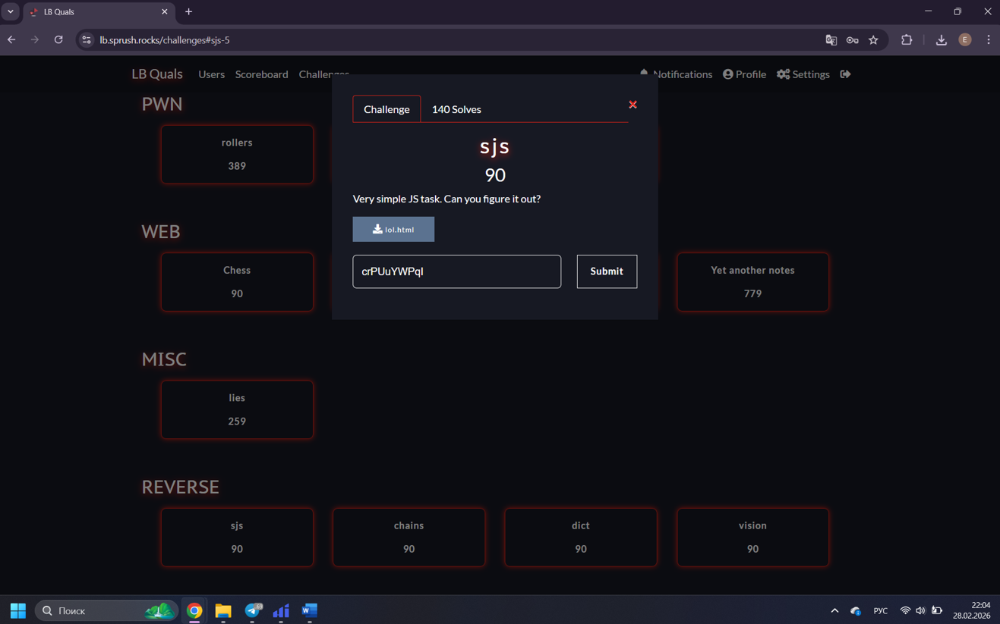

Открываем файл `lol.html` в редакторе кода. Видим простую HTML-страницу с полем ввода и кнопкой:

```html
<h1>Simple flag checker</h1>
<input id="flag">
<button onclick="check()">Check</button>
```

Внутри `<script>` объявлен массив строк:

```js
var _0x1be0 = ['B8oMhql9', 'ka8KugW', 'kmozqMHC', ...];
```

Используются переменные вида `_0x3c22c, _0x5422fa`, а строки хранятся в массиве и извлекаются через вычисляемые индексы. Следовательно, необходимо перейти к динамическому анализу через DevTools.

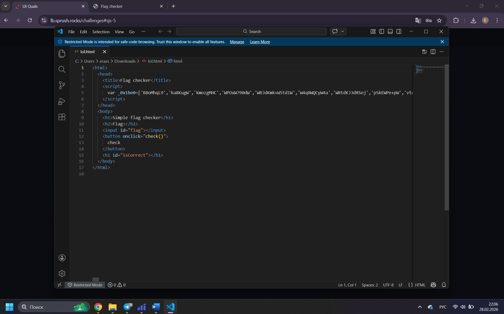

Открываем файл в браузере и переходим в DevTools → Sources. Ставим breakpoint на функцию `check()`. После нажатия кнопки выполнение останавливается внутри обфусцированной функции.

Видим создание объекта с функциями-обёртками:

```js
'ZGxju': function(a, b) {
    return a === b;
}
```

Одна из функций выполняет строгое сравнение `===`. Необходимо определить, с каким значением сравнивается введённый флаг.

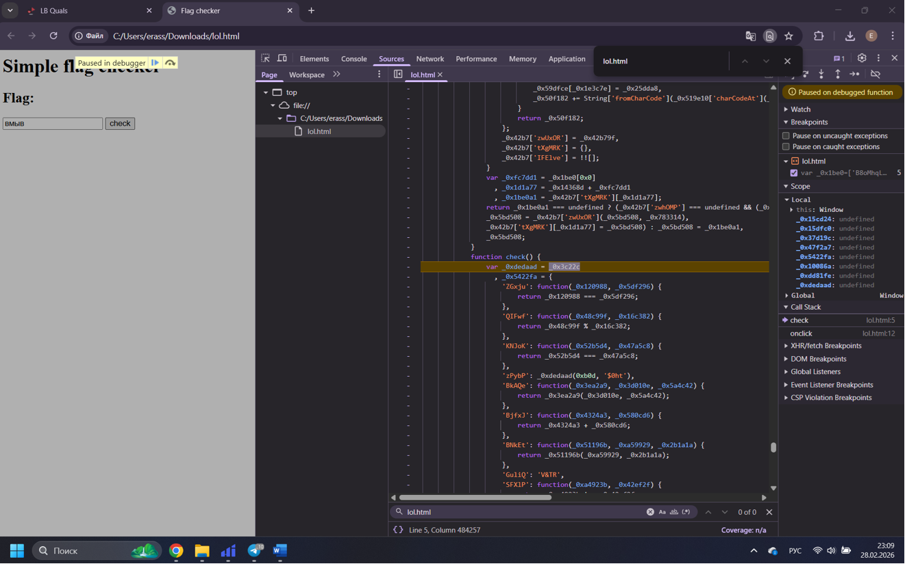

Переходим во вкладку Console и переопределяем функцию сравнения, чтобы вывести аргументы в консоль. Сначала убеждаемся, что объект доступен, затем подменяем функцию:

```js
_0x5422fa.ZGxju = function(a, b){
    console.log("A =", a);
    console.log("B =", b);
    return a === b;
}
```

Теперь при вызове `check()` в консоль будут выводиться сравниваемые значения.

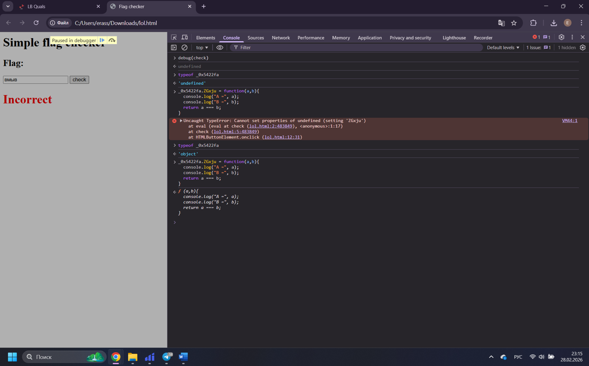

После повторного нажатия кнопки в консоли появляется длинная строка, состоящая из 0 и 1. Также в коде видно использование конструкции:

```js
.split("").reverse().join("")
```

Это означает, что бинарная строка переворачивается перед сравнением.

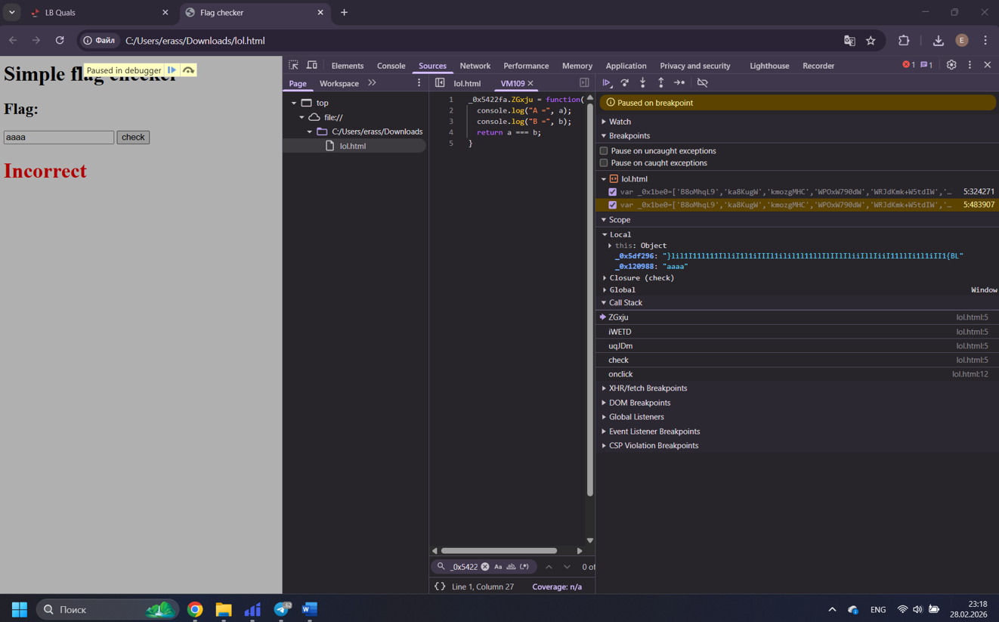

Копируем полученную бинарную строку и декодируем её.

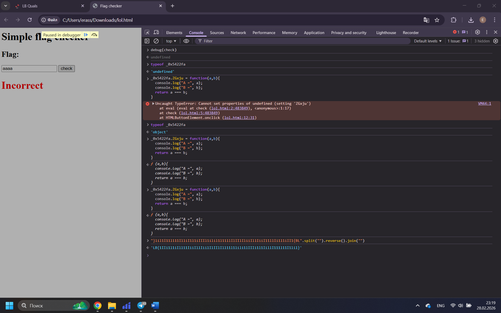

После декодирования получаем строку вида: LB{...}. Вводим её в поле на сайте.

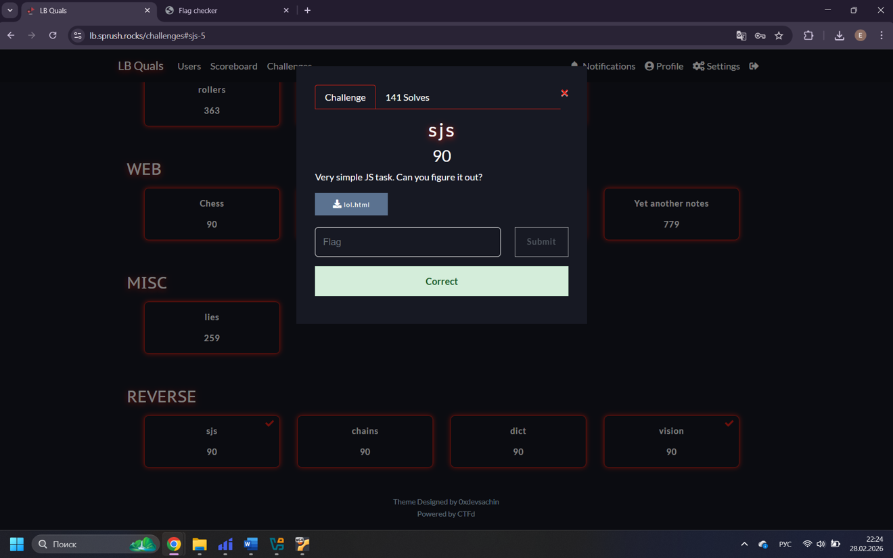

---

***vision***
---

К задаче приложен файл `task.py`.

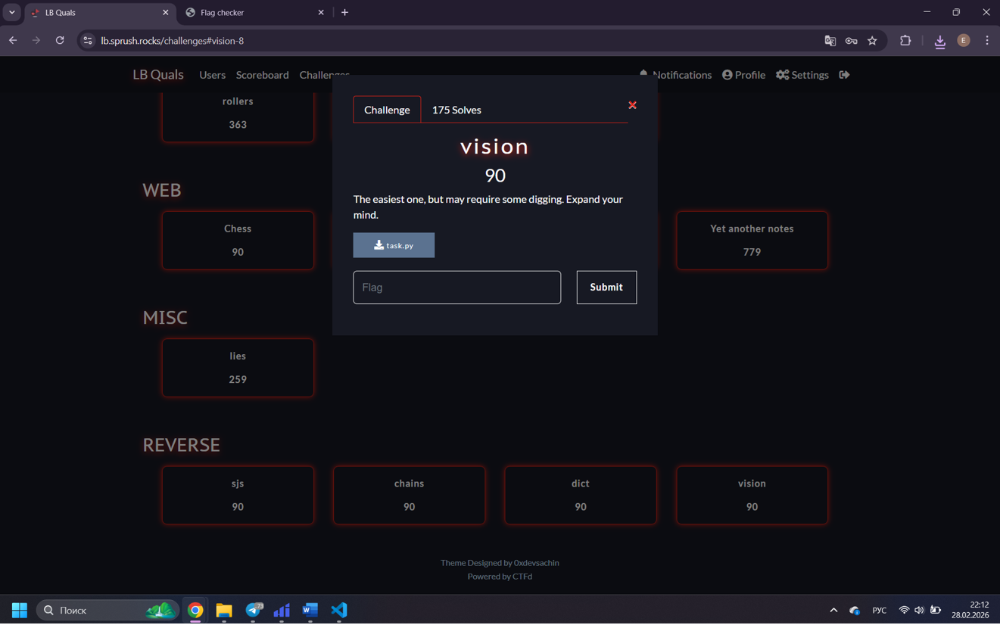

Открываем `task.py` в редакторе. Внутри видим, что ввод пользователя преобразуется, затем вычисляются хеши `sha256`, данные `salt` предварительно декодируются через `base64`, а итоговое значение формируется как XOR двух массивов байт и сравнивается с фиксированной 64-символьной hex-строкой. Это означает, что ключевая информация спрятана именно в `salt`, и её нужно корректно извлечь.

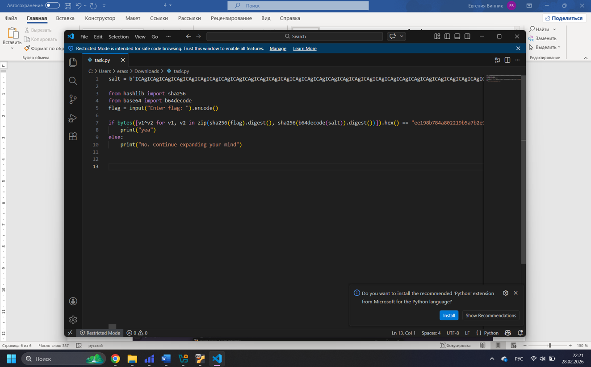

Напишем скрипт, который автоматически читает `task.py`, извлекает из него закодированную строку и целевое значение для сравнения, декодирует данные и сохраняет их в виде изображения, чтобы можно было вручную прочитать скрытую фразу. Затем он повторяет формулу из задания и перебирает несколько естественных вариантов записи прочитанного текста, проверяя каждый вариант до совпадения с целевым значением.

```python
import re
import ast
import base64
import hashlib
from pathlib import Path

def parse_task_py(path: str):
    txt = Path(path).read_text(encoding="utf-8", errors="ignore")

    m_salt = re.search(r"salt\s*=\s*(b'[^']*')", txt, re.S)
    if not m_salt:
        raise ValueError("salt literal not found")
    salt_b64 = ast.literal_eval(m_salt.group(1))

    m_target = re.search(r'==\s*"([0-9a-f]{64})"', txt)
    if not m_target:
        raise ValueError("target hex not found")
    target = bytes.fromhex(m_target.group(1))

    return salt_b64, target

def render_salt_to_png(salt_decoded: bytes, out_png: str = "salt.png", scale: int = 4):
    from PIL import Image
    lines = salt_decoded.decode("ascii", errors="ignore").splitlines()
    if not lines:
        raise ValueError("decoded salt has no lines")

    h = len(lines)
    w = max(len(l) for l in lines)
    # выровняем строки до одной ширины
    lines = [l.ljust(w, " ") for l in lines]

    img = Image.new("L", (w, h), 255)
    px = img.load()
    for y, line in enumerate(lines):
        for x, ch in enumerate(line):
            if ch != " ":
                px[x, y] = 0

    if scale and scale > 1:
        img = img.resize((w * scale, h * scale), resample=Image.NEAREST)

    img.save(out_png)
    return out_png

def check_flag(flag: str, salt_hash: bytes, target: bytes) -> bool:
    f = flag.encode()
    lhs = bytes(a ^ b for a, b in zip(hashlib.sha256(f).digest(), salt_hash))
    return lhs == target

def main():
    task_path = "task.py"  # поменяй, если файл в другом месте
    salt_b64, target = parse_task_py(task_path)

    salt_dec = base64.b64decode(salt_b64)
    salt_hash = hashlib.sha256(salt_dec).digest()

    out_png = render_salt_to_png(salt_dec, out_png="salt.png", scale=4)
    print(f"[+] Rendered ASCII art to: {out_png}")

    required_digest = bytes(a ^ b for a, b in zip(target, salt_hash))
    print(f"[i] Required sha256(flag) = {required_digest.hex()}")

    phrase = "reading ascii art should be easier for humans"

    variants = set()
    for prefix in ["LB", "Lb", "lb", "lB"]:
        for inner in [phrase, phrase.replace(" ", "_"), phrase.replace(" ", "-")]:
            for wrap in [("{", "}"), ("[", "]"), ("(", ")")]:
                variants.add(f"{prefix}{wrap[0]}{inner}{wrap[1]}")
                variants.add(f"{prefix}{wrap[0]}{inner.upper()}{wrap[1]}")
                variants.add(f"{prefix}{wrap[0]}{inner.lower()}{wrap[1]}")

    more = set()
    for v in variants:
        more.add(v)
        more.add(v + ".")
        more.add(v + "!")
    variants = more

    for v in sorted(variants):
        if check_flag(v, salt_hash, target):
            print("[+] FOUND FLAG:", v)
            return

    print("[-] Flag not found in generated variants.")
    print("    Open salt.png, read the sentence, and adjust the phrase/format in the script if needed.")

if __name__ == "__main__":
    main()
```

Запустим скрипт и получим флаг.

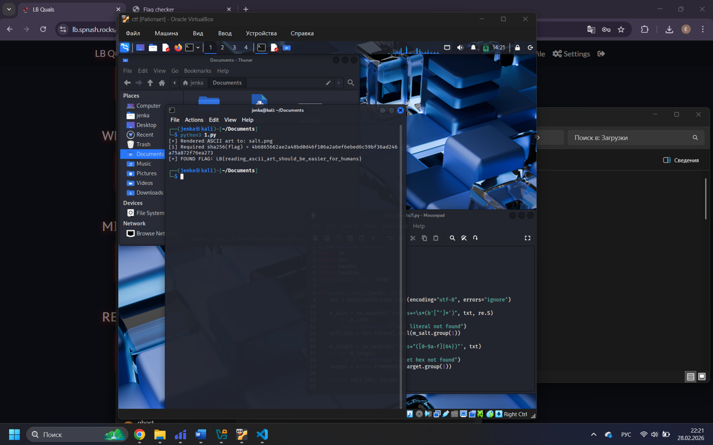

Введем найденный флаг.

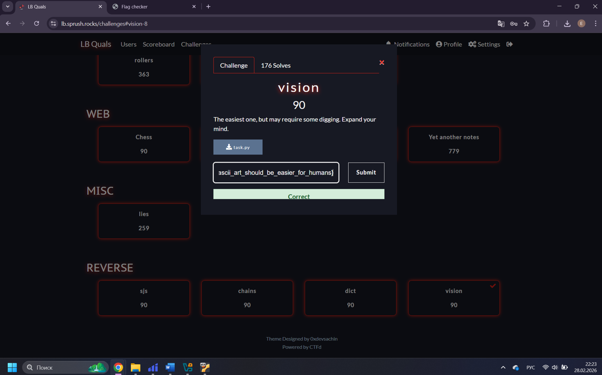

---

***chains***
---

К задаче приложен файл `task.py.zst`.

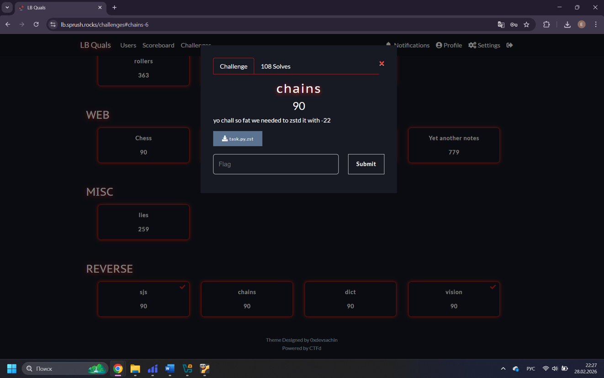

После распаковки получаем огромный `task.py`, состоящий из тысяч строк. Внутри видно большое количество проверок отдельных символов строки ввода по индексам, например сравнения вида `inp[число]` с конкретным символом.

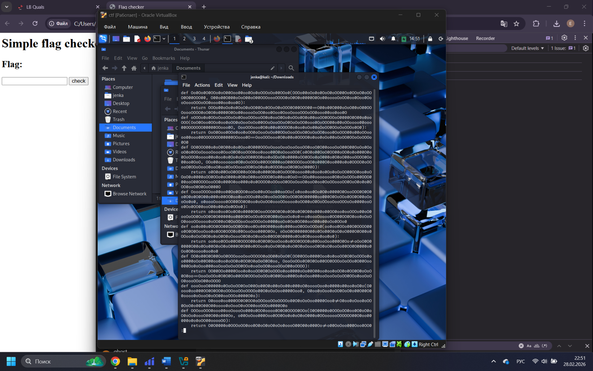

Наишем скрипт, который ищет в коде все конструкции с обращением к `inp[индекс]` и соответствующим символом. Скрипт собирает символы по их позициям в массив и затем объединяет в одну строку.

```python
import re

length = 200000 
result = [""] * length

with open("task.py") as f:
    data = f.read()

matches = re.findall(r'inp\[(\d+)\],\s*"(.?)"', data)

for idx, char in matches:
    result[int(idx)] = char

matches2 = re.findall(r'inp\[(\d+)\]\s*==\s*"(.?)"', data)

for idx, char in matches2:
    result[int(idx)] = char

max_index = max(int(i) for i, _ in matches + matches2)
flag = "".join(result[:max_index+1])

print(flag)
```

После запуска получается длинная строка — это закодированная версия флага.

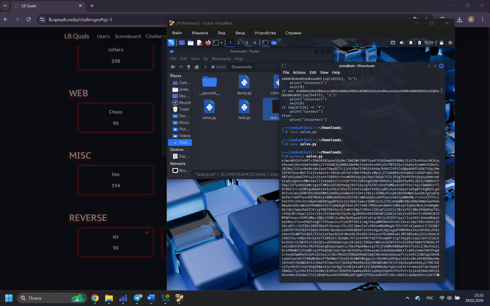

Напишем скрипт, который принимает полученную строку и многократно применяет к ней декодирование `base64` и распаковку через `zlib`.

```python
import base64
import zlib

encoded = """полученная строка"""

for i in range(400):
    encoded = zlib.decompress(base64.b64decode(encoded))

print(encoded.decode())
```

Запускаем скрипт, получаем флаг.

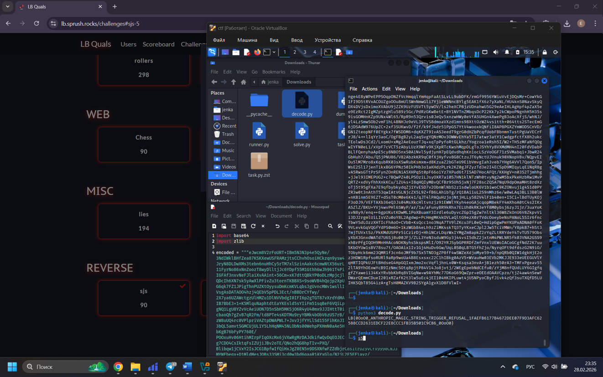

Вводим полученный флаг на сайте.

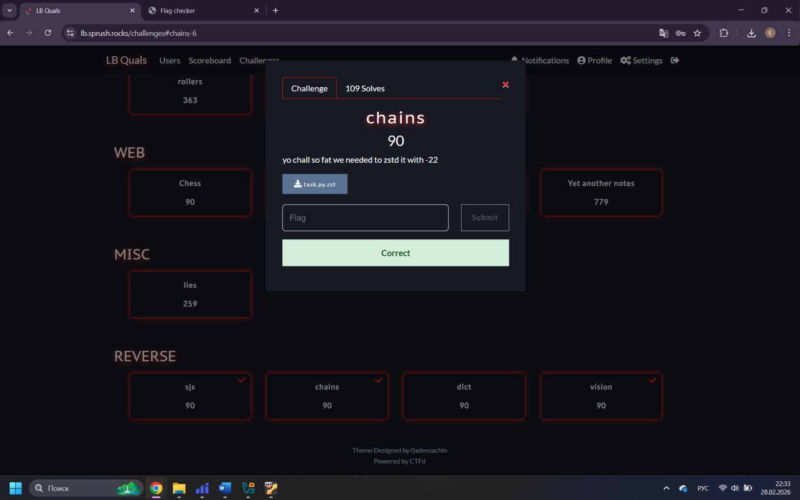

---

***Chess***
---

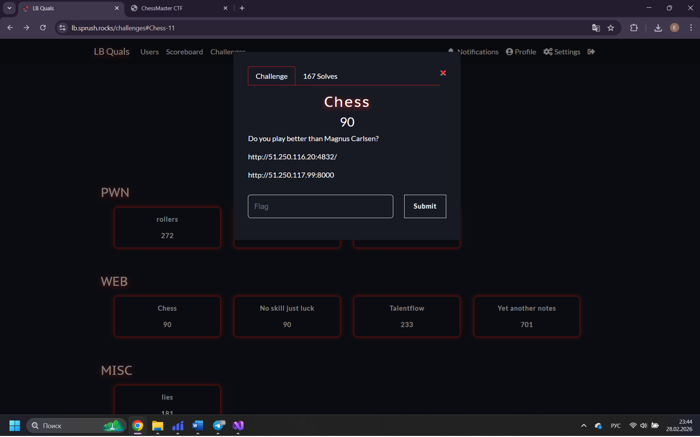

Переходим по ссылке и видим веб-интерфейс шахматной доски.

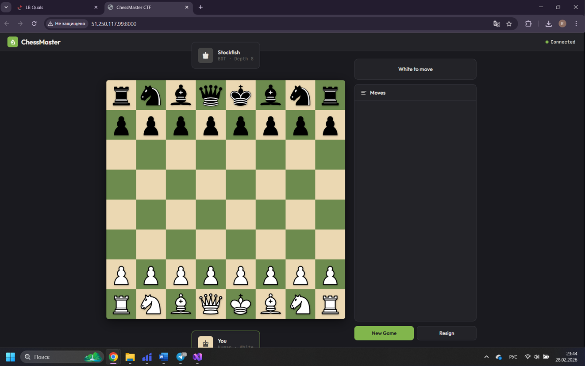

Для надёжного решения используем внешний шахматный анализ, воспроизводя позицию и подбирая выигрышную последовательность ходов. После выполнения корректной серии ходов достигается позиция мата и выводится флаг.

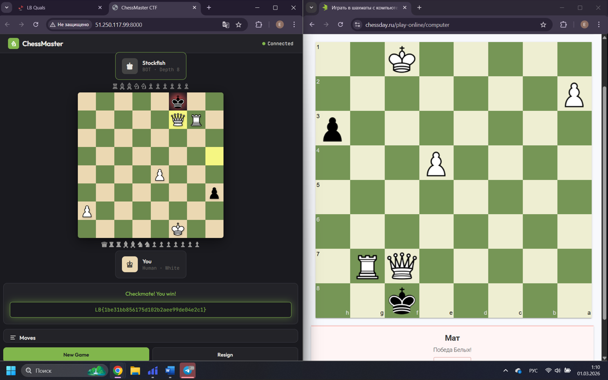

Вводим полученный флаг на сайте. 

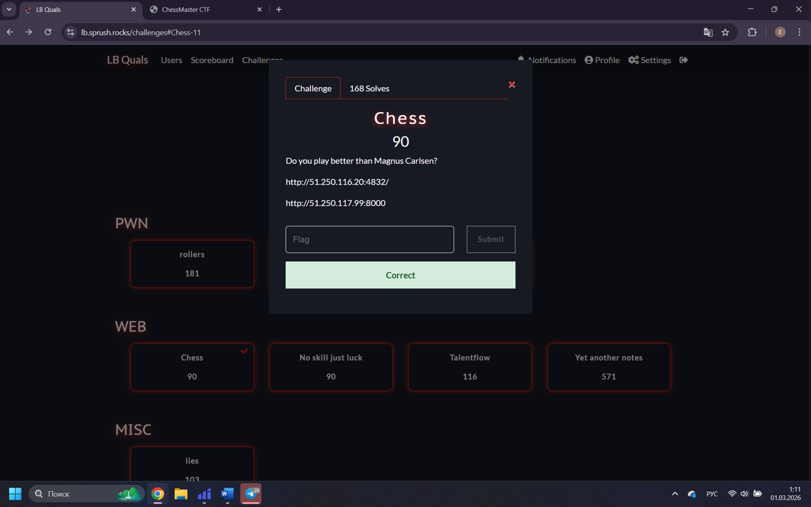
